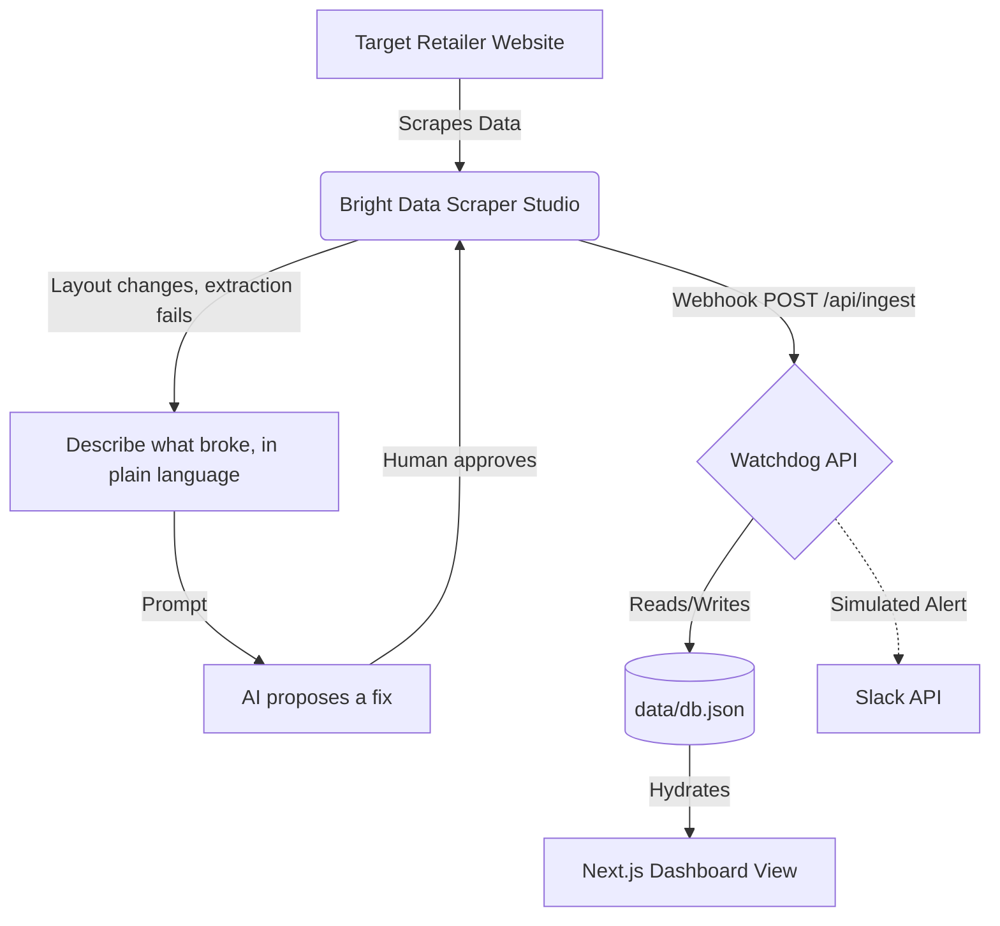

# The Price-Gouging Watchdog

An automated, self-healing data pipeline and dashboard built to detect real-time price gouging on critical emergency supplies during natural disasters.

Submitted for the Bright Data "Into the Scrape-Verse" Hackathon.

## The Problem & Solution

During crises (hurricanes, wildfires, etc.), bad actors frequently hike prices on essential goods like generators, water, and plywood. Exposing this requires monitoring e-commerce hardware and grocery sites.

However, these sites actively implement anti-bot measures and frequently change their DOM structures (class names, div nesting), causing standard scrapers to break exactly when they are needed most.

The Watchdog solves this by utilizing Bright Data's Scraper Studio. Our custom scraper monitors target items, and when a retailer changes their site layout, we trigger Scraper Studio's AI self-healing to remap the extraction logic without rewriting any code. The ingested data is fed into a Next.js dashboard that calculates price spikes and flags anomalies.

## Bright Data Scraper Studio Integration (Required Explanation)

Our project relies entirely on a custom scraper built within Bright Data Scraper Studio.

### How it is used
- **Targeting:** The scraper is configured to navigate to product URLs and extract the item name, current price, original price, and stock status.
- **Self-Healing Selectors:** E-commerce sites dynamically alter their CSS classes to prevent scraping. When our target site's layout changes and the original selectors break, we trigger Scraper Studio's self-healing tool with a plain-language description of what broke (e.g. "the price class changed, find the new element containing the price"). Scraper Studio's AI analyzes the current DOM, proposes a new extraction, and we approve the fix — after which the scraper reads correctly again with no manual selector rewriting.
- **Data Delivery:** The scraper is run against the target, and on completion sends a webhook POST request containing the structured data to our Next.js API route (`/api/ingest`), which writes it to a local JSON store and updates the live dashboard.

### Example Structured Output
```json
{
  "data": [
    {
      "id": "item-001",
      "name": "Honda EU2200i Portable Generator",
      "price": 1450.00,
      "originalPrice": 899.00,
      "retailer": "HardwareDepot",
      "url": "https://hardwaredepot.com/generators/eu2200i",
      "inStock": true,
      "timestamp": "2026-08-18T10:26:00.000Z"
    }
  ],
  "metadata": {
    "runId": "bd-run-xyz123",
    "success": true,
    "duration": 4.2
  }
}
```

## Architecture
- **Scraper:** Custom JavaScript scraper built in Bright Data Scraper Studio
- **Ingestion:** Webhook → Next.js API route (`/api/ingest`)
- **Storage:** Local JSON file store (prototype-scale persistence, not a full database)
- **Frontend:** Next.js / React "Watchdog" dashboard — compares incoming prices to baseline, flags spikes as critical, simulates downstream Slack alerts
- **Break/Heal Demo Target:** A honeypot page (`/demo-target`) with a "Simulate Retailer Layout Change" button that scrambles the price element's DOM/CSS on demand, so the break-and-heal cycle shown in the demo video is real and reproducible

## Current State & Roadmap

Built in hackathon-week scope, so a few things are intentionally simplified for now:

- **Storage:** data persists to a local JSON file rather than a hosted database (Postgres/Mongo) — fine for a prototype, would need to change for production use.
- **Scheduling:** the scraper is currently triggered manually (via Scraper Studio's Run button or a local webhook call) rather than running on an automated schedule. Scraper Studio supports scheduled runs; wiring that up is the natural next step.
- **Alerting:** the Slack alert to consumer protection agencies is simulated in the current build, not wired to a real Slack workspace or agency endpoint.

## Repository Structure

```text
watchdog/
├── data/
│   └── db.json                 # Local persistent storage for scraper webhook data
├── src/
│   ├── app/
│   │   ├── api/ingest/route.ts # Next.js API endpoint handling Bright Data webhook POSTs
│   │   ├── demo-target/        # The honeypot e-commerce site for the break/heal video demo
│   │   ├── globals.css         # Custom CSS tokens and UI styling
│   │   ├── layout.tsx          # App shell and Sidebar navigation
│   │   └── page.tsx            # Main Watchdog Dashboard view
│   ├── components/             # Reusable UI components (LiveStream, AnomalyChart, etc.)
│   └── lib/
│       └── storage.ts          # Logic for writing incoming webhook data to db.json
└── package.json
```

## Running Locally

1. Clone the repository.
2. Install dependencies: `npm install`
3. Run the development server (configured for standard port 3000): `npm run dev`
4. Open [http://localhost:3000](http://localhost:3000/) in your browser.

*Note: this boots the dashboard shell against whatever is already in `data/db.json`. To see live data flow end-to-end, you also need to expose `/api/ingest` publicly (e.g. via `ngrok http 3000`) and point a Bright Data Scraper Studio collector's webhook delivery at that tunnel URL. Without that, the dashboard has nothing new to display.*

## Architecture Diagram




## AI Usage Disclosure

In accordance with hackathon rules, we disclose that AI coding assistants (including Google's Antigravity IDE and Gemini models) were used during development to assist with Next.js boilerplate, UI component styling, and markdown documentation generation. Claude (Anthropic) was used as a planning and review assistant — for demo-script structure, verifying claims against Bright Data's actual documented behavior, and reviewing this README for accuracy. All core logic, system architecture, and Bright Data integrations were directed and validated by the team.
